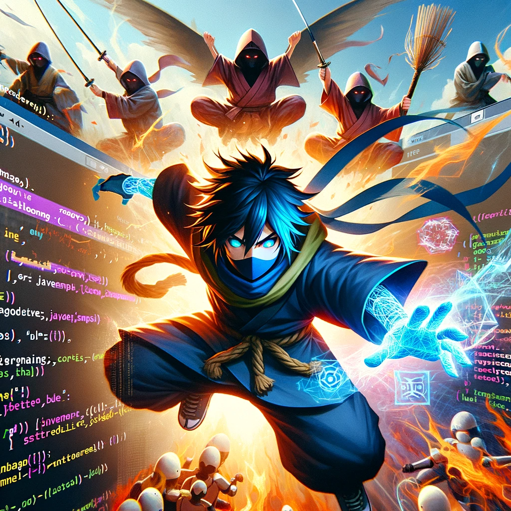

# Ninja Battle Simulator

Simple text-based game that simulates battles between Naruto characters. The game will make use of JavaScript fundamentals to manage character stats, execute battles, and determine the winner. Here are the key components of the project:

- Character Objects: Create JavaScript objects to represent different Naruto characters. Each object should have properties such as name, health points (HP), and attack points (AP).

- User Input: Implement a function to take user input to select two characters for battle. You can use the prompt() function for this.

- Battling Logic: Write JavaScript functions that simulate battles between characters. You can use random numbers for attack points and update character HP accordingly.

- Conditionals: Use if/else statements to determine the winner of each battle based on the characters' HP. Display a message indicating the winner.

- Loops: Create a loop that allows the user to continue battling or exit the game. Use a while loop to keep the game running until the user decides to quit.

- Type Conversion: Ensure that user input for character selection is properly converted to the corresponding character objects.

- Switch Statement: Use a switch statement to display the menu for character selection and other game options.

- Arrays: Store the Naruto characters in an array for easy access and selection during battles.

- Functions: Organize your code into functions for character creation, battling, user input, and menu display.

- Console Output: Use console.log() to display the game's progress and results.

- Logical Operators: Implement logical operators to check for conditions like character selection validation.
